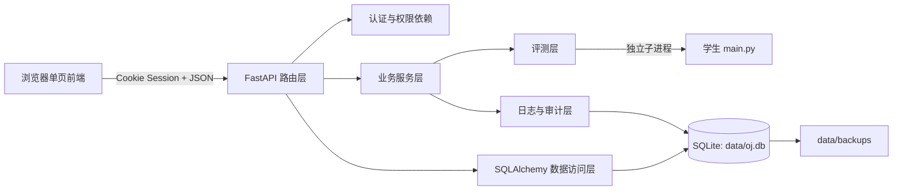

# OJ 系统实验报告

## 1. 项目概述

### 1.1 项目目标

本项目使用 Python 与 FastAPI 实现一个小型但流程完整的 Online Judge。用户能够在浏览器中注册和登录、浏览题目、提交 Python 代码，并查看异步评测状态、分数和权限允许的测试点日志；教师和管理员能够维护题目、查看全部提交和完整日志、发起重新评测；管理员能够管理用户并备份或恢复系统数据。

### 1.2 已完成功能

已完成的基础功能包括：

- Cookie Session 认证、bcrypt 密码哈希、学生/教师/管理员三类角色
- 题目增删改查、Pydantic 字段校验、测试点唯一性及总分 100 校验；
- 学生端题目脱敏，隐藏完整 `test_cases` 和 SPJ 源码；
- Python 独立子进程评测、多测试点计分、AC/WA/RE/TLE/SE 状态、输出规范化和临时目录清理；
- 提交的 `pending -> running -> finished/failed` 状态流转、异步启动、分页筛选、所有权检查与重新评测；
- 测试点级评测日志、隐藏测试点裁剪、路径脱敏、长度截断和敏感日志访问审计；
- SQLite 持久化、管理员备份列表、创建备份和恢复备份；
- 原生 HTML/CSS/JavaScript 单页前端，包括学生流程、教师题目/提交管理和管理员管理页面；
- pytest 自动化测试，当前 35 项全部通过。

### 1.3 未完成功能

未完成的部分包括：
- 运行学生代码的内存限制与安全隔离
- 代码相似度检测
- 分布式任务队列
- 备份 SQLite 数据库的完整性校验

### 1.4 持久化方式

持久化方式选择 SQLite。主数据库位于 `data/oj.db`，用户、密码哈希、题目、测试点、提交、评测日志、审计日志和备份记录均持久化；备份文件位于 `data/backups/`。

### 1.5 进阶模块

项目初步实现了 special judge 功能：
- 兼容 standard，strict 和 spj 三种判题标准
- 允许教师和管理员上传，替换和删除special_judge 代码，学生无法看到apj源码
- 判题时通过 subprocess 调用 spj 判断学生代码输出是否符合要求，spj超时和异常返回SE

## 2. 系统架构


- 路由层：`app/routers/` 定义认证、用户、题目、提交、日志和备份接口。所有业务路由均为 `async def`，并统一挂载在 `/api` 下。
- 业务层：`app/services/` 负责密码处理、当前用户/角色依赖、后台评测调度、日志视图和审计记录。
- 数据访问层：`app/repositories/database.py` 创建 SQLAlchemy engine、Session 和数据目录；`tables.py` 定义 ORM 表。
- 评测层：`app/judge/runner.py` 使用 `subprocess.run` 在临时目录内逐测试点执行 `main.py`，进行超时控制和输出比较。
- 日志层：评测日志与审计日志均写入 SQLite；`sanitize()` 和 `truncate()` 负责统一脱敏与截断。
- 前端层：`frontend/index.html`、`styles.css`、`app.js` 构成无构建步骤的单页应用，由 FastAPI 同源提供。

## 3. 数据设计

| 对应对象 | pydantic模型/ORM表 | 关键字段 |
| --- | --- | --- |
| 3.1 用户 | `User` / `users` | `id`、`username`、`password_hash`、`role`、`is_active` |
| 3.2 题目 | `Problem` / `problems` | `id`、`title`、`description`、`test_cases`、`time_limit`、`memory_limit`、`judge_mode` |
| 3.3 测试点 | `Problem.test_cases` JSON 列 | `case_id`、`input`、`output`、`score`、`is_hidden` |
| 3.4 提交 | `Submission` / `submissions` | `id`、`user_id`、`problem_id`、`source_code`、`status`、`result`、`score`、`total_time` |
| 3.5 评测日志 | `JudgeLog` / `judge_logs` | `submission_id`、`case_id`、`result`、`score`、`time_used`、`stdout`、`stderr`、`is_hidden` |
| 3.6 审计日志 | `AuditLog` / `audit_logs` | `operator_id`、`action`、`target_type`、`target_id`、`success`、`created_at` |
| 3.7 备份记录 | `Backup` / `backups` | `id`、`created_at` |

题目中的 `samples`、`tags` 和 `test_cases` 采用 JSON 字段，减少课程规模下的表连接；提交、日志、用户和题目使用独立表，便于权限过滤、分页和历史追踪。

## 4. 核心实现

### 4.1 异步启动评测

`POST /api/submissions` 创建状态为 `pending` 的记录后调用 `asyncio.create_task(run_judge(id))`，立即以 HTTP 202 返回提交编号。后台协程将状态改为 `running`，再通过 `asyncio.to_thread()` 执行子进程评测。

### 4.2 运行和终止学生代码

每次评测使用操作系统临时目录 `light-oj/` 下的独立 `TemporaryDirectory`，源码保存为 `main.py`。评测器用当前 Python 解释器运行该文件，将测试点输入写入标准输入，并捕获标准输出、标准错误、退出码和耗时。每个测试点分别使用题目的 `time_limit`；`subprocess.run(..., timeout=...)` 超时会终止子进程并生成 TLE。上下文退出后临时目录自动删除。

### 4.3 判断 AC、WA、RE、TLE 和 SE

- AC：退出码为 0，UTF-8 解码成功，规范化后的输出等于标准答案；
- WA：程序正常退出，但输出不一致；
- RE：非零退出码或输出无法按 UTF-8 解码；
- TLE：单个测试点超过时间限制；
- SE：后台评测器异常，或实验性 SPJ 执行/返回异常/超时。

AC 测试点获得其全部分值，其他结果为 0，总分为已执行测试点得分之和。普通评测遇到 RE 或 TLE 后停止后续测试点；WA 会继续执行，以便给出部分分数。最终结果按 TLE、RE、WA 的优先顺序归并，全部通过时为 AC。

### 4.4 比较输出

基础 `standard` 模式先将 `\r\n` 和 `\r` 统一为 `\n`，再删除每行末尾空格和制表符，并删除文件末尾多余空行。行首空格、行内空格及额外提示语不会被忽略。扩展的 `strict` 模式直接比较原始字符串。`spj` 模式在子进程中执行 `judge_code`，传入 `stdin` 、 `stdout` 和 `expected_out`，`judge_code` 按约定返回评测结果。

### 4.5 提交状态管理

成功完成后状态为 `finished` 并写入结果、得分、总耗时和测试点日志；评测服务异常时状态为 `failed`、结果为 `SE`，同时写入系统日志。服务启动时会将上次异常退出遗留的 `pending/running` 提交标记为 `failed/SE`，避免永久停留在中间状态。只有 `finished` 或 `failed` 状态允许教师重新评测，否则返回 409。重新评测会先清空旧结果与时间并恢复为 `pending`。

### 4.6 权限校验

 `app\services\auth.py` 负责校验权限：`current_user()` 依次检查 Session 是否有登录记录、用户是否存在和未被禁用；`teacher()` 与 `admin()` 在调用 `current_user()` 的基础上，检查用户是否拥有教师/管理员权限。用户操作依赖于上述三个权限管理函数，如提交代码等依赖 `current_user()`，创建、修改和删除题目，查看完整评测日志等依赖 `teacher()`，管理用户，创建和恢复备份等依赖 `admin()`

### 4.7 隐藏测试点

项目通过 `problem_view()` 和 `log_view()` 处理题目和测试点的隐藏。学生获取题目时，统一的 `problem_view()` 删除 `test_cases` 和 `spj`。读取评测日志时，`log_view()` 对隐藏测试点删除 `input_data`、`stdout` 和 `expected_output`，但保留测试点编号、结果、得分、耗时和裁剪后的错误信息；教师与管理员可以看到完整日志，并产生 `VIEW_FULL_JUDGE_LOG` 审计记录。

### 4.8 日志脱敏和截断

`app\routers\logs.py` 对日志进行处理，`trancted()` 对日志字符串进行处理，输出、错误和消息最长保留 4000 字符，超出后追加 `...[truncated]`。`sanitize()` 将 Windows 或 Unix 中学生 `main.py` 的绝对路径替换为 `<submission>/main.py`，并移除 traceback 中带源码绝对路径的 `File ...` 行。该转换集中在服务层，避免不同日志接口出现不一致。

### 4.9 数据持久化和恢复

SQLAlchemy 将用户、题目、提交、日志、审计和备份记录写入 `data/oj.db`。创建备份时先提交备份元数据和审计日志，再释放数据库连接，将数据库复制到独立目录并生成记录时间、存储类型和文件列表的 `manifest.json`。

恢复前先确认备份目录中的 `oj.db` 与 `manifest.json` 同时存在，缺失时返回 404，不修改当前数据库。校验通过后释放当前数据库连接，将当前 `oj.db` 复制为 `.rollback` 回滚副本，再把选定的备份复制为 `.restore` 临时文件，最后使用原子替换更新主数据库。

恢复操作由异常处理保护：复制备份或替换主数据库时发生错误，会用 `.rollback` 原子替换主数据库并重新抛出异常；恢复成功后主动删除 `.rollback`，成功回滚时该文件也会在替换中被消耗；无论成功或失败，都会清理 `.restore`。

### 4.10 前端如何维护登录状态、调用接口并展示结果

前端 javascript 通过 `api()` 对 `/api` 发起 JSON 请求并调用 fastapi 路由接口，获取返回结果并写入 HTML 模板。前端请求时使用同源 Cookie 以保持登录会话。通过哈希路由提供题目、提交、日志、题目管理和管理员页面。

## 5. API 说明

### 5.1 认证与用户

| 方法与路径 | 权限 | 主要请求/响应 | 常见错误 |
| --- | --- | --- | --- |
| `POST /api/auth/register` | 公开 | 用户名、密码；创建 student | 409 重名，422 字段错误 |
| `POST /api/auth/login` | 公开 | 用户名、密码；建立 Session 并返回用户 | 401 凭据错误，403 已禁用 |
| `POST /api/auth/logout` | 公开 | 清除 Session | - |
| `GET /api/auth/me` | 已登录 | 当前用户，不含密码哈希 | 401，403 |
| `GET /api/users` | admin | 分页用户列表 | 401，403，422 |
| `GET /api/users/{user_id}` | admin | 用户详情 | 404 |
| `PUT /api/users/{user_id}` | admin | `role`、`is_active`；返回修改后用户 | 400 禁用自己，404，422 |

### 5.2 题目

| 方法与路径 | 权限 | 主要请求/响应 | 常见错误 |
| --- | --- | --- | --- |
| `GET /api/problems` | 已登录 | 分页列表；学生视图无测试点/SPJ | 401，403，422 |
| `GET /api/problems/{problem_id}` | 已登录 | 分角色题目详情 | 404 |
| `POST /api/problems` | teacher/admin | 完整题目；创建后返回 201 | 409 编号重复，422 校验失败 |
| `PUT /api/problems/{problem_id}` | teacher/admin | 完整题目；编号不可修改 | 400 编号变化，404，422 |
| `DELETE /api/problems/{problem_id}` | teacher/admin | 删除题目配置 | 404 |

题目请求包括题面、样例、限制、难度、标签、测试点、`judge_mode` 和可选 SPJ 源码；测试点编号必须唯一且分数总和必须为 100。

### 5.3 提交与日志

| 方法与路径 | 权限 | 主要请求/响应 | 常见错误 |
| --- | --- | --- | --- |
| `POST /api/submissions` | 已登录且启用 | `problem_id`、`language=python`、`source_code`；返回 202、编号和 pending | 404 题目不存在，422 空/超大代码 |
| `GET /api/submissions` | 已登录 | 分页；支持题目、用户、状态、结果、时间筛选，学生固定为本人 | 401，403，422 |
| `GET /api/submissions/{id}` | 本人/teacher/admin | 提交详情 | 403 非本人，404 |
| `POST /api/submissions/{id}/rejudge` | teacher/admin | 重置状态并返回 202 | 404，409 状态冲突 |
| `GET /api/submissions/{id}/logs` | 本人/teacher/admin | 提交和分角色测试点日志 | 403，404 |
| `GET /api/logs` | teacher/admin | 完整日志分页及组合筛选 | 401，403，422 |
| `GET /api/logs/audit-logs` | admin | 审计日志分页及操作者/动作/目标/时间筛选 | 401，403，422 |

### 5.4 备份

| 方法与路径 | 权限 | 主要请求/响应 | 常见错误 |
| --- | --- | --- | --- |
| `POST /api/admin/backups` | admin | 创建数据库和 manifest，返回 201 | 401，403，500 |
| `GET /api/admin/backups` | admin | 备份记录列表 | 401，403 |
| `POST /api/admin/backups/{backup_id}/restore` | admin | 安全替换数据库，异常时回滚，提示重新登录 | 404 备份缺失，500 |

## 6. 测试结果

在 Python 3.14.0 环境执行：

```text
python -m pytest -q
................................... [100%]
35 passed, 66 warnings in 24.44s
```

66 条 warning 均来自 FastAPI 依赖中对 Python 3.14 已弃用 `asyncio.iscoroutinefunction` 的调用，不影响测试结果。

35 项测试覆盖认证与权限、题目 CRUD 和字段校验、隐藏测试点、提交与重新评测、AC/WA/RE/TLE、输出规范化、SPJ、日志处理、SQLite 持久化以及备份恢复。备份相关测试包括：

- 正常创建、列出和恢复备份，并确认 `.restore`、`.rollback` 均被清理；
- 备份数据库文件缺失时返回 404，当前数据保持不变；
- 新增 `test_restore_rolls_back_current_database_on_error`，在主数据库已完成替换后模拟异常，验证恢复前的数据被还原，且两个临时文件均无残留。

## 7. 问题与解决过程

### 7.1 Uvicorn 热重载打断评测

早期临时源码位于应用源码目录内，写入 `main.py` 会触发 `uvicorn --reload` 的文件监控，使服务重启并中断正在运行的评测。最终将评测目录移动到操作系统临时目录 `light-oj/`，并用 `TemporaryDirectory` 管理生命周期。从而不触发源码热重载。

### 7.2 阻塞式子进程与异步接口冲突

`subprocess.run()` 能稳定处理 stdin、stdout、stderr 和 timeout，但直接在 FastAPI 路由中调用会阻塞事件循环。解决方式是提交接口只创建记录并通过 `asyncio.create_task()` 启动后台协程，再用 `asyncio.to_thread()` 包装包含 `subprocess.run()` 的评测器。接口能够在评测结束前返回 202，状态变化则持久化到数据库供前端轮询。

### 7.3 隐藏测试点与完整日志共用数据

数据库必须保存完整测试点日志供教师排错，但学生响应不能泄露隐藏输入和答案。如果在多个路由中手动删字段，容易遗漏。项目将转换封装到 `problem_view()` 与 `log_view()`：前者按角色删除题目敏感字段，后者按 `is_hidden` 和角色生成日志视图。

## 8. AI 工具使用说明

本项目使用 Codex, Claude Code 以及网页端 Chatgpt 作为 AI 辅助工具。其中 Codex 和 Claude Code 参与了数据库和api接口的检查和debug，网页前端的辅助制作和美化，pytest 的辅助制作等，网页端 Chatgpt 参与项目架构设计和封装，学习陌生概念和所需库的用法等（大作业的技术栈与课堂知识基本正交）。

### 生成内容的处理方式

生成内容通过以下方式处理：阅读源码，删除本项目中不必要的冗余代码、过度封装和重复防御；重构项目的路由，工具函数等部分以匹配作业要求；通过运行 fastapi 的自带文档以及运行pytest检查api接口的可靠性；检查前端界面效果，交互方式是否有效，以及是否与后端接口对应，手动删除和重构前端中 AI 画蛇添足的部分，通过 AI 协助编程补全未能正常实现交互的接口。AI 生成的代码均经过本人修改和确认。
